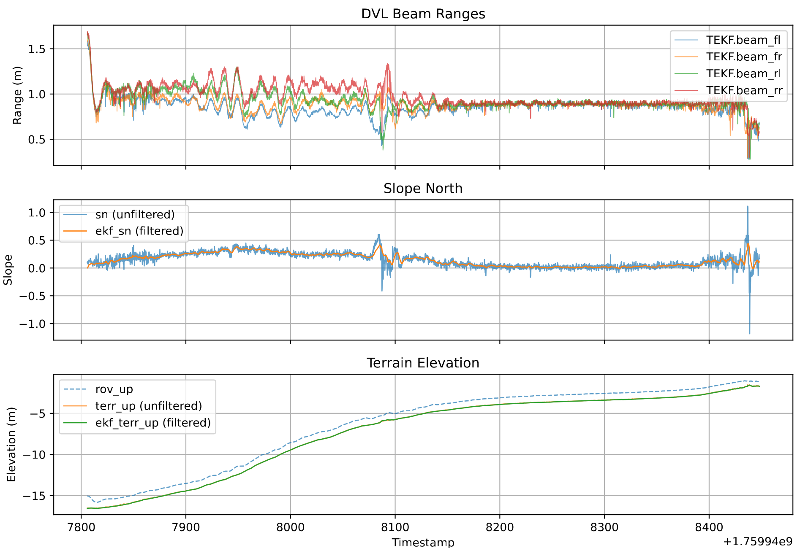
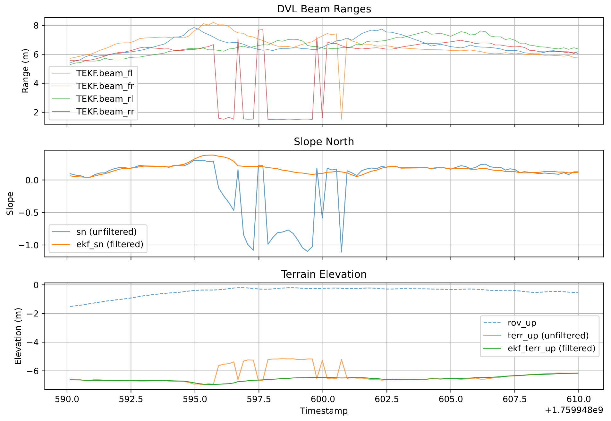

# Using Surftrak with a DVL

## Motivation

The Seattle Aquarium runs transects 1 meter above the seafloor to capture images for scientific purposes.
The range, or HAGL (height above ground level), should be as consistent as possible during the transect.
This is partially automated using the [SURFTRAK](https://github.com/clydemcqueen/ardusub_surftrak) flight mode, which adjusts target depth based on rangefinder readings.

## The Problem: Sensor Delay

As noted in the SURFTRAK [documentation](https://github.com/clydemcqueen/ardusub_surftrak#sensor-notes), sensor delays (e.g., ~300ms for the Water Linked A50) cause oscillations.
HAGL is calculated as `rov_z - terrain_z`; while `rov_z` is known at `t_now`, the range measurement reflects the state at `t_capture`.
This latency, combined with varying delays and sensor noise, limits the effectiveness of simple feedback loops or PID tuning.

## Proposed Solution

Instead of treating the DVL as a simple rangefinder, we use the 4 individual beam readings to estimate the terrain geometry below the ROV.
We can use a Terrain Extended Kalman Filter (TerrainEKF) to:
1.  **Estimate terrain slope**: Use the beam readings to calculate terrain slope (north/east).
2.  **Predict HAGL**: Use ROV velocity and the estimated slope to predict HAGL change, compensating for latency.
3.  **Reject outliers**: Use the slope estimate to predict expected beam readings and reject anomalies (e.g., obstacles, fish) using Normalized Innovation Squared (NIS).

### Beam Splitter

The [beam splitter project](https://github.com/Seattle-Aquarium/CCR_development/issues/16) modified the WaterLinked DVL BlueOS extension to publish the 4 individual beam distances to ArduSub as additional `DISTANCE_SENSOR` messages, enabling per-beam processing.

### TerrainEKF

We use a 3-state EKF: `[terrain_z, slope_n, slope_e]`.

**Prediction Step:** Projects the state forward using ROV velocity:
*   `terrain_z += (vel_n * slope_n + vel_e * slope_e - vel_d) * dt`
*   `slope_n` and `slope_e` are assumed constant (random walk).

**Update Step:** Uses beam geometry to predict measurements. NIS is used to reject individual beam readings that deviate significantly from the planar terrain model.

**Projection:** The TerrainEKF runs at `t_capture`. We can project `terrain_z` forward to `t_now` to get a better estimate of HAGL at `t_now`.

## Log Analysis

A subset of the data collected from Elliott Bay on 2025-10-08 (with beam splitter running) is available in the `data` directory:
* transect1.tlog: The ROV has SURFTRAK engaged and is moving up-slope from south to north at a constant rate of 10 cm/s.
* transect2.tlog: Similar to transect1.
* short.tlog: The ROV is returning to the vessel west-to-east, running fairly quickly close to the surface.

We have no ground truth for the terrain, but we can estimate it using the log data, the TerrainEKF and an RTS smoother.
Using this estimate, we can calculate the MSE for the current and proposed terrain estimation methods.

Results:
~~~
$ ./replay_terrain.py data/transect1.tlog
Parse data/transect1.tlog
DVL DISTANCE_SENSOR messages found:       31900
DVL DISTANCE_SENSOR messages dropped:     0 (0.00%)
DVL sets reconstructed:                   6380
MSE current:  0.000266
MSE proposed: 0.000116
Improvement:    56.31%
NEES average: 0.16

$ ./replay_terrain.py data/transect2.tlog
Parse data/transect2.tlog
DVL DISTANCE_SENSOR messages found:       28545
DVL DISTANCE_SENSOR messages dropped:     0 (0.00%)
DVL sets reconstructed:                   5709
MSE current:  0.000226
MSE proposed: 0.000064
Improvement:    71.43%
NEES average: 0.14

$ ./replay_terrain.py data/short.tlog
Parse data/short.tlog
DVL DISTANCE_SENSOR messages found:       9200
DVL DISTANCE_SENSOR messages dropped:     25 (0.27%)
DVL sets reconstructed:                   1835
MSE current:  0.050239
MSE proposed: 0.001470
Improvement:    97.07%
NEES average: 0.90
~~~

In all cases the MSE is substantially lower for the proposed method.

We can also plot the results:

~~~
./replay_terrain.py --csv data/transect2.tlog
./graph_results.py data/transect2_TEKF.csv
~~~

This is from `transect2_graph2.pdf`:

The slope is initially significant but drops substantially at T=8100 in the graph.
Even with the dampened response, the ROV depth oscillation is substantially worse in the steeper part of the transect,
which we would expect based on the current design. 

This is from `short_graph2.pdf`:

The ROV is fairly close to the surface. From the video we can see that it pauses at T=595 and one of the thrusters
forces some air into the water column, interrupting two of the four sonar beams. The bad readings are rejected by the EKF.